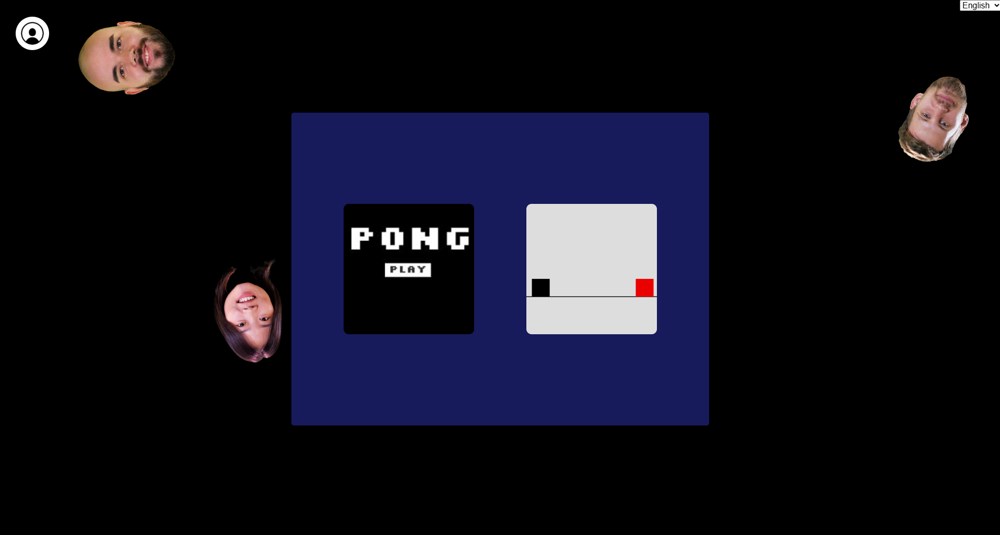
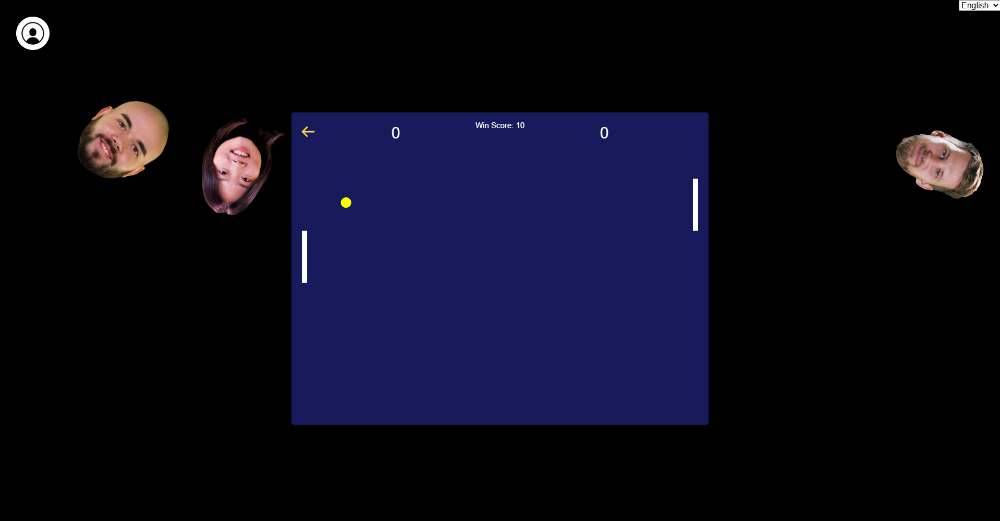

# ft_transcendence

A full-stack real-time Pong platform built as a team project at Codam (42 Network).  
It includes multiplayer Pong matches, tournaments, authentication with 2FA, live chat, and social features — all running in a Dockerized production-like environment.

This is my fork of the team project where I worked as one of two backend developers.

---

## 🚀 Features

### 🎮 Multiplayer Pong
- Real-time gameplay using WebSockets  
- Matchmaking and tournament support  
- Game state synchronization between clients

### 🔐 Authentication & Security
- JWT-based authentication  
- Two-Factor Authentication (2FA)  
- User session management  
- User profiles

### 💬 Social Features
- Live chat (WebSocket-based)  
- Friends system (add/remove friends)  
- Online/offline presence  
- Match history

---

## 🛠️ Tech Stack

- **Backend**: **Python**, **Django**, **Django REST Framework**, **WebSockets** (Django Channels), **JWT Authentication**
- **Frontend**: **JavaScript**, **Bootstrap**
- **Databases**: **PostgreSQL**, **Redis**
- **Infrastructure**: **Docker**, **Docker Compose**, **Nginx** as reverse proxy, **HTTPs**

---

## 🧩 My Contribution

I worked on the backend architecture and implementation, including:

- Building REST API endpoints (Django + DRF)  
- Implementing JWT authentication and 2FA  
- Designing database models (PostgreSQL)  
- WebSocket communication for real-time gameplay  
- Integrating backend components with Docker and Nginx  
- Handling user management, access control, and social features  

---

## Installation

**1.** Clone this repository.

**2.** Create ".env" files in "backend" and "db" folders with the same contant as ".env.example" in these folders.

Command to get your HOST_IP:

```ip route get 1 | awk '{print $7; exit}'```

Command to generate DJANGO_SECRET_KEY:

```python3 -c "import secrets; print(secrets.token_urlsafe(50))"```


**3.** Run it with ```docker compose up -d``` command in project's folder.


Application will be available at:
https://localhost:8443/

## 📸 Screenshots



